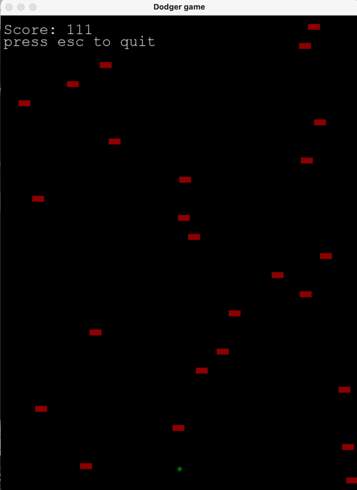

## Dodger Game

in my game version, the player is a green ball, and the obstacles are red rectangles

### structure

- src
  - enemy.py
    > class for Obstacles
  - game_attributes.py
    > attributes for the game
  - main.py
    > main driver program to start the game
  - player.py
    > player class for the player
  - world.py
    > world setup for the game
  - requirements.txt
    > required packages

### environment

this project assumes you are running under python 3.7 and under macOS, so recommend using macOS and start the instructions below

### How to run the project

1. `conda create -n ticktocknetwork_env python=3.7 anaconda` to install a new virtual env
2. `pip install -r requirements.txt` to install all the packages
3. in `main.py` hit run if you have IDE (I am using visual studio code) or `python main.py` in the terminal when you are at the source directory

# Released under MIT License

Copyright (c) 2013 Mark Otto.

Copyright (c) 2017 Andrew Fong.

Permission is hereby granted, free of charge, to any person obtaining a copy of this software and associated documentation files (the "Software"), to deal in the Software without restriction, including without limitation the rights to use, copy, modify, merge, publish, distribute, sublicense, and/or sell copies of the Software, and to permit persons to whom the Software is furnished to do so, subject to the following conditions:

The above copyright notice and this permission notice shall be included in all copies or substantial portions of the Software.

THE SOFTWARE IS PROVIDED "AS IS", WITHOUT WARRANTY OF ANY KIND, EXPRESS OR IMPLIED, INCLUDING BUT NOT LIMITED TO THE WARRANTIES OF MERCHANTABILITY, FITNESS FOR A PARTICULAR PURPOSE AND NONINFRINGEMENT. IN NO EVENT SHALL THE AUTHORS OR COPYRIGHT HOLDERS BE LIABLE FOR ANY CLAIM, DAMAGES OR OTHER LIABILITY, WHETHER IN AN ACTION OF CONTRACT, TORT OR OTHERWISE, ARISING FROM, OUT OF OR IN CONNECTION WITH THE SOFTWARE OR THE USE OR OTHER DEALINGS IN THE SOFTWARE.
